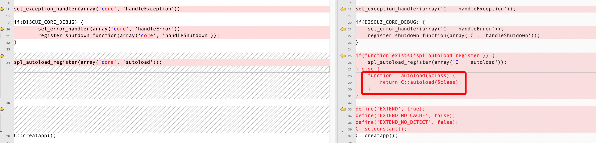
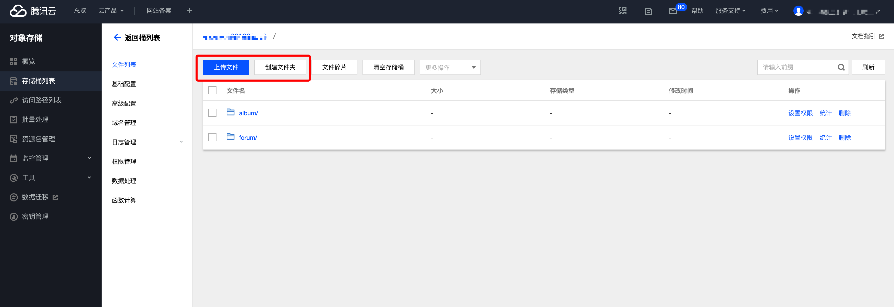
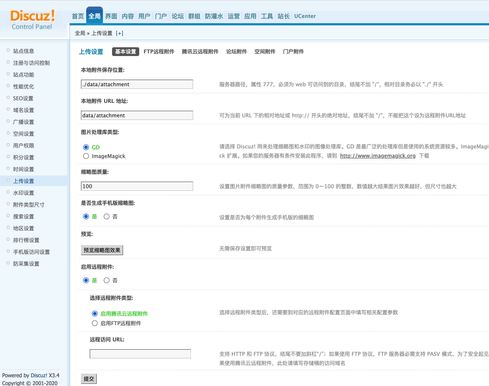
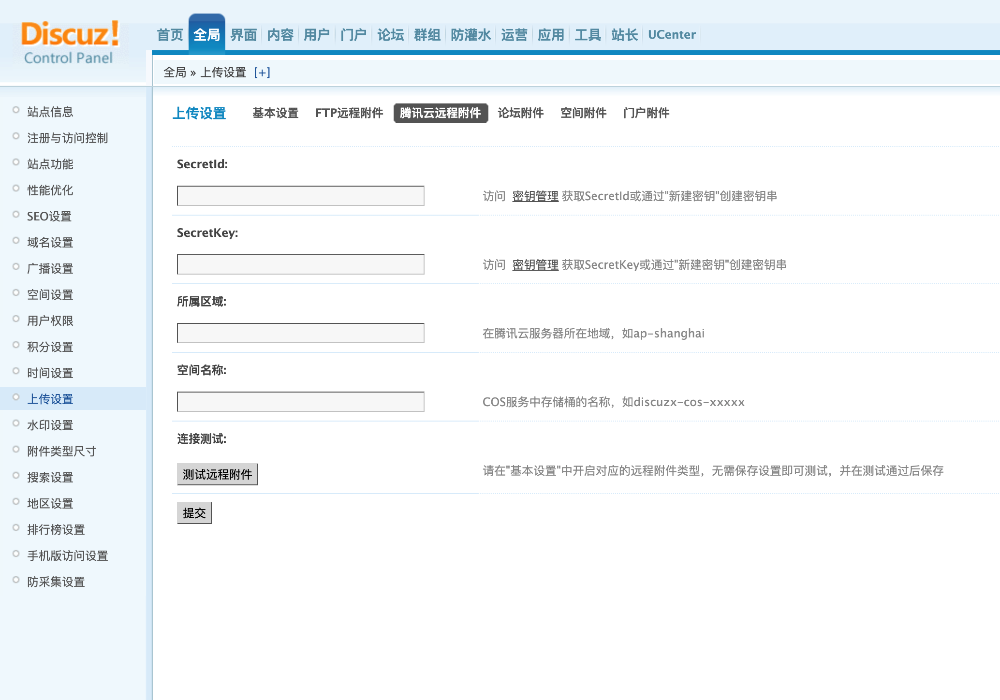

# 腾讯云对象存储扩展

## 1.扩展介绍
> 腾讯云对象存储扩展给Discuz！X站点用户提供附件远程存储功能。实现网站静态媒体资源与腾讯云COS的互通，有效降低本地存储负载，提升用户访问网站媒体资源的体验。

| 标题       | 内容                                                         |
| ---------- | ------------------------------------------------------------ |
| 中文名称     | 腾讯云对象存储扩展                                         |
| 最新版本   | v1.0.0 (2020.08.03)                                           |
| 适用平台 | [Discuz! X](https://www.discuz.net) |
| 适用产品 | [腾讯云对象存储（COS）](https://cloud.tencent.com/product/cos)      |
| GitHub项目| [Discuz! X 官方 Git ](https://gitee.com/ComsenzDiscuz/DiscuzX) |
| 主创团队   | 腾讯云中小企业产品中心（SMB Product Center of Tencent Cloud）  
- 本项目由腾讯云中小企业产品中心建设和维护
- 请通过[咨询建议](https://support.qq.com/products/164613)向我们提交宝贵意见。

## 2.功能特性

- 发帖、回复贴子、写日志、创建相册时上传的附件保存到腾讯云的对象存储空间中
- 删除帖子、删除日志、删除相册时同步删除腾讯云对象存储空间中的附件

## 3.安装指引

### 3.1.部署方式一：Discuz！X3.4版本通过补丁升级安装
> 1. 在[GitHub](https://github.com/Tencent-Cloud-Plugins/tencentcloud-discuzx-plugin-cos) 中获取补丁包
> 2. 将补丁包中的文件中修改的部分合并到源站中的对应的文件
> 3. 在./upload目录下新增extend目录及目录下的文件
> 4. 合并./upload/source/class/class_core.php
> 5. 合并./upload/source/function/function_core.php
> 6. 合并./upload/source/admincp/admincp/admincp_checktools.php
> 7. 合并./upload/source/admincp/admincp/admincp_setting.php
> 8. 合并./upload/source/admincp/language/lang_admincp.php
> 9. 合并./upload/source/module/forum/forum_attachment.php

- **补充1**：php7.2之后已经移除了__autoload()函数，如果出现告警需要注释或删除upload/source/class/class_core.php文件中的"__autoload()"函数

- **补充2**：Discuz!X版本更新比较频繁，可能在最新的版本中代码和本次修改的代码会有重叠部分，建议使用文件比较工具认真比较合并且在修改代码前做好本地备份。
- **补充3**：当前扩展中不支持将历史附件上传到腾讯云的对象存储功能，如果需要同步历史附件到腾讯云存储中，需要站点维护人员手动上传历史附件。在同步历史附件前请做全站备份。
> 1. 可使用[工具概览](https://cloud.tencent.com/document/product/436/6242)中介绍的上传工具上传附件。
> 2. 也可以腾讯云对象存储控制台中直接上传文件,附件在存储桶中的路径和附件在本地的'/upload/data/attachment/'目录下的相对路径一致。

## 4.使用指引

### 4.1.界面功能介绍

> 在Discuz！X站点后台全局配置的基本设置中选中"启用远程附件"，然后选中"启用腾讯云远程附件", 在远程访问 URL中填入腾讯云存储桶的访问域名

> 将页面切换到"腾讯云远程附件"配置页面
> 在"腾讯云远程附件"配置页面中就配置腾讯云对象存储的SecretId、SecretKey、所属区域、空间名称的信息
> 填写好配置参数后可以点击"测试远程附件"按钮，确认配置是否正确

### 4.2.名词解释
- **自定义密钥**：插件提供统一密钥管理，既可在多个腾讯云插件之间共享SecretId和SecretKey，也可为插件配置单独定义的腾讯云密钥。
- **SecretId**：在腾讯云云平台API密钥上申请的标识身份的 SecretId。详情参考[腾讯云文档](https://cloud.tencent.com/document/product)
- **SecretKey**：在腾讯云云平台API密钥上申请的标识身份的SecretId对应的SecretKey。详情参考[腾讯云文档](https://cloud.tencent.com/document/product)
- **所属地域**：在腾讯云服务器所在地域。详情参考[腾讯云文档](https://cloud.tencent.com/document/product/457/44232)
- **空间名称**：COS服务中存储桶的名称。详情参考[腾讯云文档](https://cloud.tencent.com/document/product/436/41153)
- **远程访问 URL**：存储桶的访问域名。详情参考[腾讯云文档](https://cloud.tencent.com/document/product/436/6224)

## 5.FAQ

> 暂无
## 6.致谢

此功能是在[Discux！X扩展框架](https://www.discuz.net/thread-3334048-1-1.html) 的基础上实现，特此对其主创团队进行致谢。