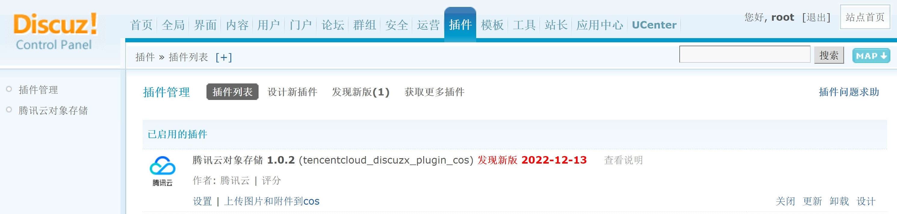
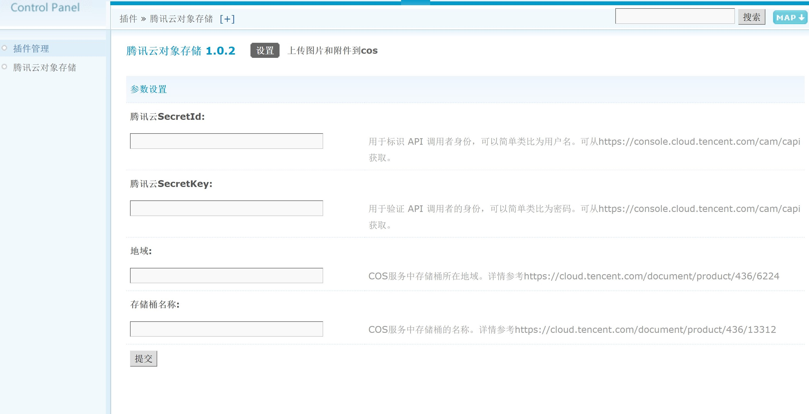
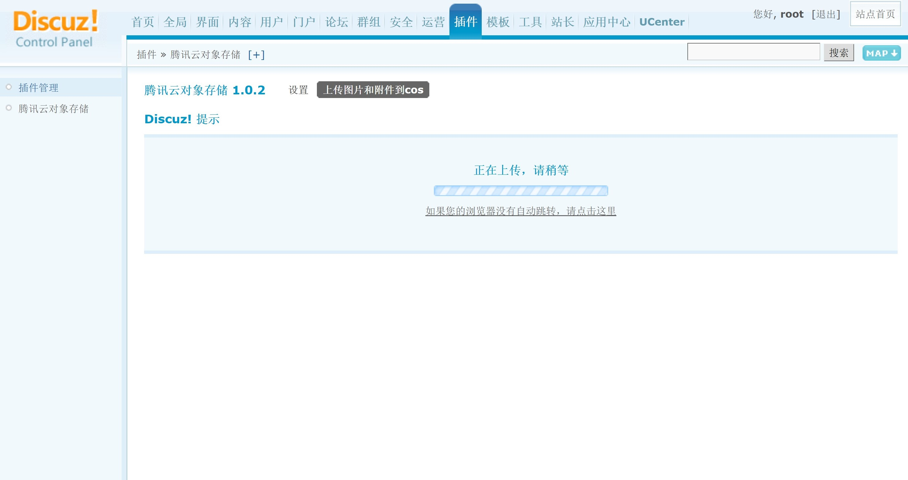

# 腾讯云对象存储扩展

## 1.扩展介绍

> 腾讯云对象存储扩展给Discuz！X站点用户提供附件远程存储功能。实现网站静态媒体资源与腾讯云COS的互通，有效降低本地存储负载，提升用户访问网站媒体资源的体验。

| 标题       | 内容                                                         |
| ---------- | ------------------------------------------------------------ |
| 中文名称   | 腾讯云对象存储扩展                                           |
| 最新版本   | v1.0.2 (2022.11.30)                                          |
| 适用平台   | [Discuz! X3.4](https://www.discuz.net)                       |
| 适用产品   | [腾讯云对象存储（COS）](https://cloud.tencent.com/product/cos) |
| GitHub项目 | [Discuz! X 官方 Git ](https://gitee.com/ComsenzDiscuz/DiscuzX) |
| 主创团队   | 腾讯云COS                                                    |

## 2.功能特性

- 上传discuz！X3.4版本博客帖子中的图片到腾迅云cos存储桶中

## 3.安装指引

### 3.1.部署方式一：通过GitHub部署离线安装

> 1. git clone https://github.com/Tencent-Cloud-Plugins/tencentcloud-discuzx-plugin-cos
> 2. 复制tencentcloud-discuzx-plugin-cos目录拷贝到discuzx的插件存放路径/source/plugin/文件夹里面
> 3. 你的discuz站点管理中心=》插件=》安装插件**“腾迅云对象存储 1.0.1”**，后启用即可

### 3.2.部署方式二：通过Discuz!X官网插件中心对应插件界面下载安装

> 1. 前往[discuz插件中心-腾讯云对象存储1.0.1](https://addon.dismall.com/plugins/tencentcloud_discuzx_plugin_cos.html)点击安装应用
> 2. 根据网站引导填入站点信息后即可安装成功
> 3. 你的discuz站点管理中心=》插件=》找到插件**“腾迅云对象存储 1.0.1”**启用即可

### 3.3.部署方式三：通过本地Discuz!X站点跳转插件中心部署安装

> 1. 你的discuz站点管理中心=》插件=》获取更多插件。在页面搜索框输入“腾迅云对象存储”，下载作者为腾讯云的免费插件即可

### 4.1.界面功能介绍

> 在Discuz！X站点后台插件模块中找到腾讯云对象存储插件安装启用。点击设置

> 填入个人存储桶的腾讯云对象存储的SecretId、SecretKey、所属地域、存储桶名4个信息
> 填写好配置参数后可以点击上传图片和附件到cos

> 等待上传完成即可，完成后可在个人存储桶中找到discuz！x中的附件

### 4.2.名词解释

- **自定义密钥**：插件提供统一密钥管理，既可在多个腾讯云插件之间共享SecretId和SecretKey，也可为插件配置单独定义的腾讯云密钥。

- **SecretId**：在腾讯云云平台API密钥上申请的标识身份的 SecretId。详情参考[腾讯云文档](https://cloud.tencent.com/document/product)

- **SecretKey**：在腾讯云云平台API密钥上申请的标识身份的SecretId对应的SecretKey。详情参考[腾讯云文档](https://cloud.tencent.com/document/product)

- **地域**：在腾讯云服务器所在地域。详情参考[腾讯云文档](https://cloud.tencent.com/document/product/457/44232)

- **存储桶名称**：COS服务中存储桶的名称。详情参考[腾讯云文档](https://cloud.tencent.com/document/product/436/41153)

  

## 5.FAQ

> 暂无

## 6.致谢

此功能是在[Discux！X扩展框架](https://www.discuz.net/thread-3334048-1-1.html) 的基础上实现，特此对其主创团队进行致谢。
---

本项目由腾讯云存储产品中心建设和维护，了解与该插件使用相关的更多信息，请访问https://cloud.tencent.com/document/product/436/40605
